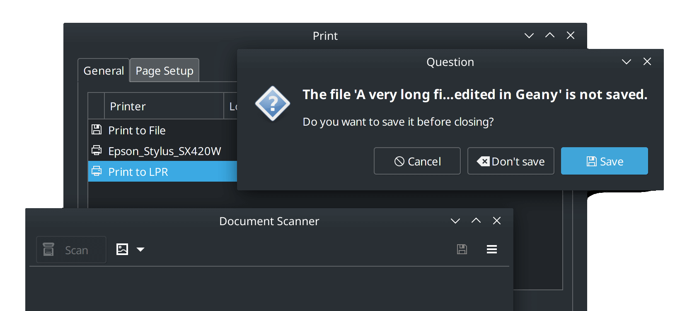

# gtk3-classic

_(Previously known as gtk3-mushrooms)_

This repository contains patches to restore GTK3's look & feel reminiscent to
earlier versions. With many enhancements such as disabled CSD headers,
traditional dialog boxes and file browser improvements.

These are designed to work on non-GNOME desktops (such as XFCE and MATE)
as well as any other environment where GTK applications are used. Running
on GNOME desktops is not recommended!

[View Screenshots](https://github.com/lah7/gtk3-classic/wiki/Screenshots)

## Packages

### Arch

Currently, these are packaged in the AUR as
[`gtk3-classic`](https://aur.archlinux.org/packages/gtk3-classic/), which is
based on the official [`gtk3`](https://archlinux.org/packages/extra/x86_64/gtk3/) package.

This package is compiled without examples or tests.

If you've previously installed `gtk3-mushrooms`, switch to this new package.

## Patches

#### Client Side Decorations (only on Xorg)

* **CSDs are disabled by default.**
  * All windows are decorated only by window manager.
  * You can enable CSDs by setting `GTK_CSD=0` environment variable (or `GTK_CSD=1` to force CSDs on each GTK3 window).
* Client side shadows of windows, menus and tooltips are disabled by default.
  * You can enable shadows by setting `GTK_CSD=1` environment variable.
* Minimize, maximize and close buttons, window title and subtitle are removed from headerbar.

#### File chooser

* **Typeahead feature is restored.**
  * Recursive file search will not be ran automatically when you start typing.
  * You can still search recursively by Left <kbd>Alt</kbd> + <kbd>S</kbd> shortcut. See https://gitlab.gnome.org/GNOME/gtk/issues/839.
* "Other locations" button is removed from Places sidebar.
  * All mounted devices and drives are accessible directly.
  * "Networks" button is added for browsing network shares.
* Trash and XDG user directories (like Pictures, Downloads, Documents) are removed from Places sidebar.
  * These can be added as bookmarks.
* File System button in Places sidebar is labeled as "File System" instead of "Computer".

#### Appearance

* Message dialogs have traditional appearance with left-aligned texts and right-aligned buttons.
* Some GTK stock icons on buttons and context menus are restored.
* Regular colorized icons instead of symbolic icons are used in file chooser dialog.
* Appearance of print dialog is less "gnomish", natural margins are restored.
* Backdrop CSS state is disabled.
  * Inactive windows don't look differently.
  * You can restore backdrop state by setting `GTK_CSD=1` environment variable.
* Status bars are smaller regardless of used theme.
* File chooser dialog, places sidebar and color chooser dialog use a traditional context menu instead of popover.

#### Default Settings

* Scrollbars are always visible.
  * You can enable invisible scrollbars by `GTK_OVERLAY_SCROLLING=1` environment variable.
* Current working directory is opened by default in file chooser dialog instead recently used files.
* Atril instead of Evince is set as default previewer in printing dialog.

#### Other

* Delay before showing mnemonics is removed. You don't have to wait when you press <kbd>Alt</kbd>.
* "Insert emoji" context menu item of entry fields is hidden.
  * You can restore it by setting `GTKM_INSERT_EMOJI` environment variable.
* Default Adwaita theme has smaller controls (buttons, fields, tabs, etc.).

#### Fixes

* ~~Menu bars are no longer covered by too high popup menus.~~ **(patch broken)**
  * See https://gitlab.gnome.org/GNOME/gtk/issues/1016.
* Labels are wrapped similarly to GTK2. This patch fixes too wide windows in applications improperly ported from GTK2.
* Errors in console output caused by integration with Accessibility Toolkit are hidden.
  * See https://unix.stackexchange.com/questions/230238.

## Contributing

We aim to keep the patches rolling across new upstream GTK3 versions
where possible. Due to our limited knowledge with C, we'd appreciate any
help in fixing bugs caused by patches or any new contributions.

Patches should not break GTK3 or any applications, and should offer "classic"
functionality as seen in GTK2 or early versions of GTK3.

## License

Patches follow the same license as GTK3, which is LGPL.
